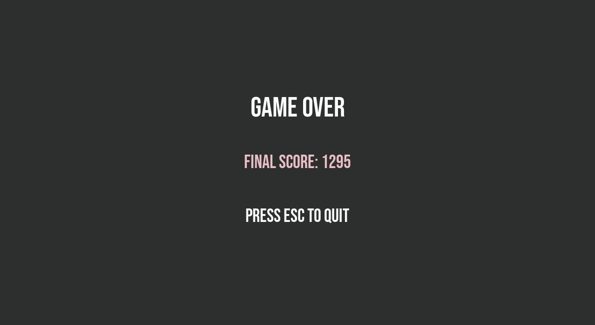

# BULLET HELL

## Screenshots

## Installation
1. Install pygame `pip3 install pygame`
2. Clone this repository
3. Run the `game.py`, `python3 game.py`
## Game Play Instructions
1. Use the `W` key to move forward
2. `S` to move backward 
3. `A` to rotate left
4. `D` to rotate right
5. Press `SPACEBAR` to shoot the gun
6. Evade the bullet hell
7. Good luck!
