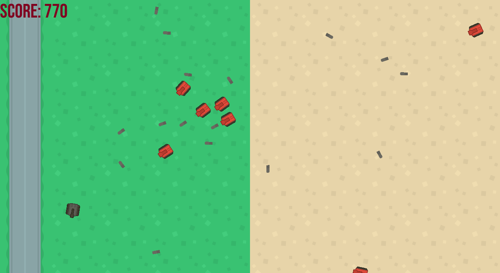
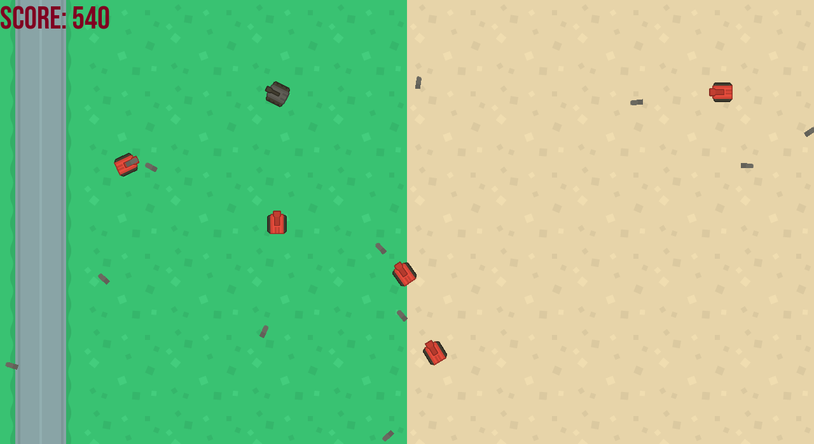

# BULLET HELL

## Screenshots

## Installation
1. Install pygame `pip3 install pygame`
2. Clone this repository
3. Run the `game.py`, `python3 game.py`
## Game Play Instructions
1. Use the `W` `A` `S` `D` keys to move the tank
2. `W` to move forward
3. `S` to move backward 
4. `A` to rotate left
5. `D` to rotate right
6. Press `SPACEBAR` to shoot the gun
7. Evade the bullet hell
8. Good luck!
